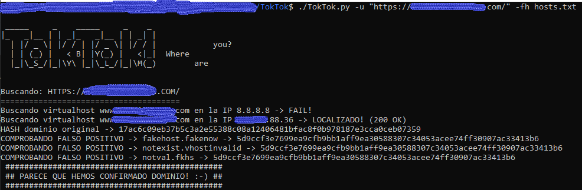

# TokTok
Script to finding hidden virtualhost (after DNS gathering), protected with WAFs such as Cloudflare, Akamai, Incapsula and wrong config in the original server.

1.- **Before use TokTok**, enumerate domains and subdomains of the enterprise (with other tools like dnsenum, fierce, etc.) and save the ip addresses (and ranges) found in a file

2.- Use TokTok to find the original server hosting the hidden virtual host

 
